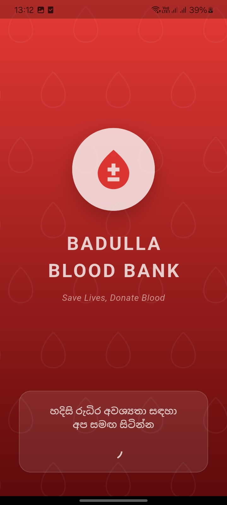
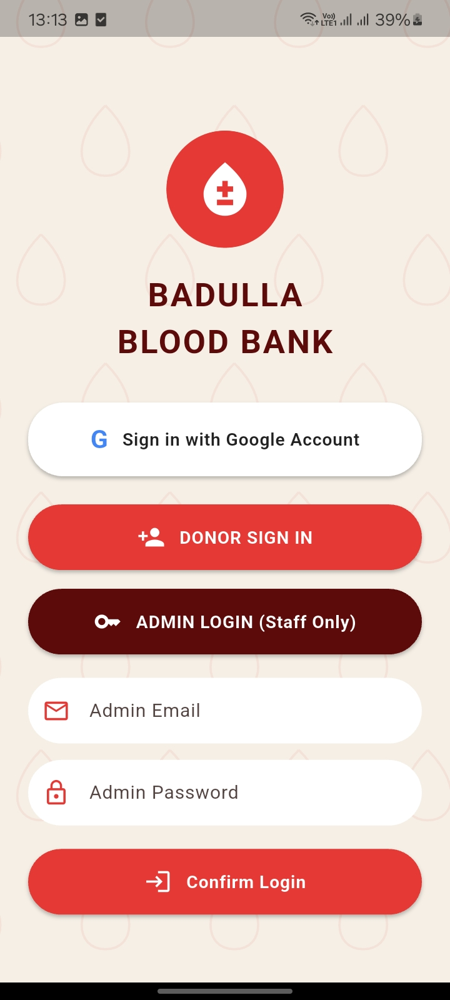
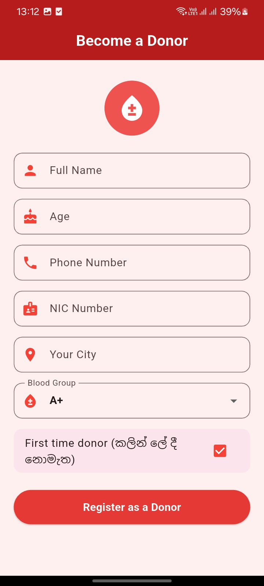
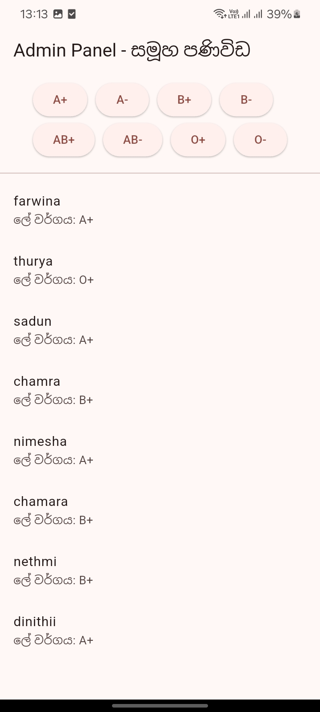
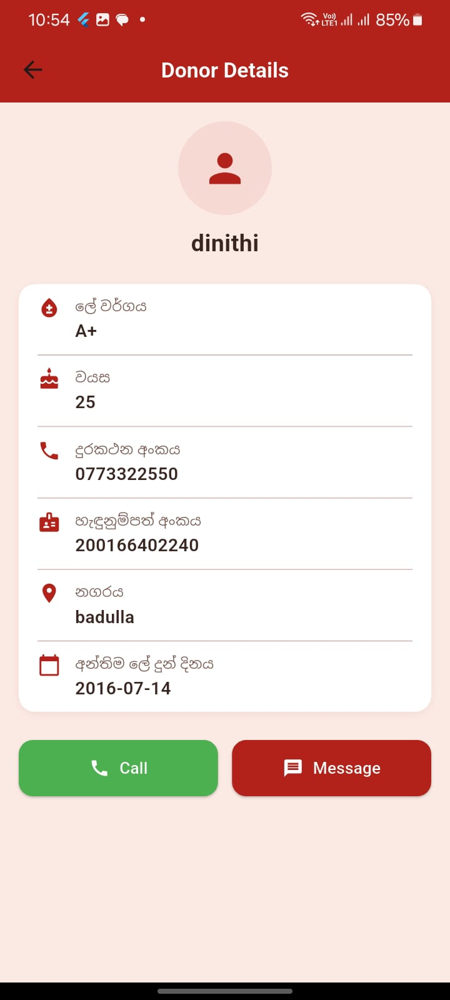

# 🩸 Badulla Blood Bank — Donor Management App
A cross-platform **Flutter** application built to manage blood donors in the **Badulla region**, connecting donors with those in need through Firebase-powered real-time features.
---
## 📸 Screenshots
| Splash Screen | Login | Donor Registration |
|:---:|:---:|:---:|
|  |  |  |

| Admin Panel | Donor Details |
|:---:|:---:|
|  |  |
## ✨ Features
### 🔐 Authentication
- Google Sign-In integration
- Secure Firebase Authentication
### 🏥 Donor Management
- Donor registration with blood group, location, and contact details
- Admin role-based access control
- Search and filter donors by blood group and region
- **Real-time donor list** in Admin Panel via Firestore `StreamBuilder`
- **Donor Details screen** — tap any donor card to view full details (blood group, age, phone number, NIC number, city, last donation date) with direct **Call** and **Message** actions
### 🔔 Notifications & Reminders
- Firebase Cloud Messaging (FCM) push notifications
- Cloud Functions for scheduled donation eligibility reminders (150-day donation cycle)
- Real-time alerts for urgent blood requests
- **Group Notification System** — Admin Panel lets staff select a blood group and instantly push an urgent-request notification to every matching donor via the `sendGroupNotification` Cloud Function
- **Device-side notification handling** (`NotificationService`) — manages notification permissions and displays foreground push notifications using `flutter_local_notifications`
### 🎨 UI/UX
- Custom splash screen
- Clean, intuitive Material Design interface
- Cross-platform support (Android, iOS, Web, Windows, macOS, Linux)
---
## 🛠️ Tech Stack
| Category           | Technology                          |
|----------------------|--------------------------------------|
| Framework           | Flutter / Dart                      |
| Backend              | Firebase (Firestore, Auth, FCM)     |
| Cloud Functions      | Firebase Cloud Functions            |
| Authentication       | Google Sign-In                      |
| State Management     | Flutter (Provider/setState)         |
| Platforms            | Android, iOS, Web, Windows, macOS, Linux |
---
## 📂 Project Structure
```
badulla_blood_donation/
├── lib/              # Main Dart source code
│   ├── admin_panel.dart           # Admin dashboard: donor list + group notifications
│   ├── donor_details_screen.dart  # Full donor details, Call/Message actions
│   ├── notification_service.dart  # FCM permission + foreground notification handling
│   ├── registration_screen.dart   # Donor registration form
│   ├── search_screen.dart         # Donor search by blood group & city
│   ├── login_screen.dart          # Google Sign-In / Admin login
│   └── main.dart                  # App entry point
├── android/          # Android platform-specific code
├── ios/              # iOS platform-specific code
├── web/              # Web platform code
├── functions/        # Firebase Cloud Functions (sendGroupNotification, scheduledBloodDonationReminder)
├── assets/           # Images, icons, and static assets
└── test/             # Unit and widget tests
```
---
## 🚀 Getting Started
### Prerequisites
- Flutter SDK (latest stable version)
- Dart SDK
- Firebase account and project
- Android Studio / Xcode (for mobile builds)
### Setup Instructions
1. **Clone the repository**
   ```bash
   git clone https://github.com/nimesha1234455/badulla_blood_donation.git
   ```
2. **Install dependencies**
   ```bash
   flutter pub get
   ```
3. **Firebase Configuration**
   - This project excludes `google-services.json` (Android) and `GoogleService-Info.plist` (iOS) for security reasons
   - Create your own Firebase project at [Firebase Console](https://console.firebase.google.com/)
   - Download `google-services.json` and place it in `android/app/`
   - Download `GoogleService-Info.plist` and place it in `ios/Runner/` (if building for iOS)
4. **Deploy Cloud Functions** (for notifications)
   ```bash
   cd functions
   npm install
   firebase deploy --only functions
   ```
5. **Run the app**
   ```bash
   flutter run
   ```
---
## 🔒 Security Notes
- Firebase configuration files are excluded from version control via `.gitignore`
- Environment variables are managed via `.env` (not committed)
- Firestore Security Rules restrict access to authenticated users only
---
## 👩‍💻 Author
**Nimesha Madushani**
HND in Information Technology — SLIATE, Sri Lanka
Mobile App Developer (Flutter) | Java Web Developer
- GitHub: [@nimesha1234455](https://github.com/nimesha1234455)
---
## 📄 License
This project is open source and available for educational purposes.
